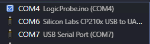
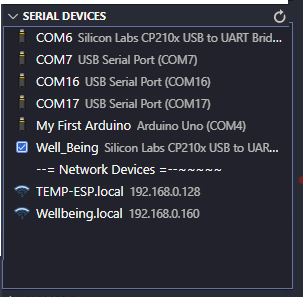
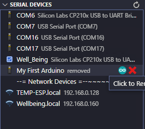

# Serial Devices

This is useful for microcontroller development. It lists the Serial Device and allows for giving them an alternate name. So instead of seeing COM3, you can rename it to ESP32_SENSOR.

It also will detect the COM port listed in the arduino.json file and highlights the one currently being used.
The COM description now shows the name of the sketch. I realize its not that useful since it only shows on the current project but its there now. Maybe I'll do something useful with it like sharing with the other windows. Maybe I'm the only one with multiple vs code projects open at the same time?



I added mDNS discovery to pull in Arduino OTA devices.
When the Extension is running, it starts the discovery. Since OTA seem to be erratic, I don't clear the list while its discovering, I stop the browser and restart it every 60 seconds. The reason for this is due to found devices may not be found again during that 60 seconds of being removed.  
After 6 minutes of scanning, it clears the list and starts again. This removes stale OTA devices. Pressing the `-=Network Devices=-` item, forces a clear and refreshes immediately.

_It seems to be important sometimes for your OTA devices to be on the same network as your computer.  ESP8266 and ESP32 only work on a 2.4G WIFI network.  So if your computer is connected to that same WIFI, OTA device will show up almost immediately.  Otherwise, it may take longer or not show up at all._




## Features

- Allows giving a COM/OTA device a name that is saved to the local storage.
- Over the Air devices with the type of 'arduino' are scanned for. This scan is on ​continuously.
- Clicking the Arduino Icon next to the device will open the Arduino Serial List selector and paste in the Value of the COM port for Serial Devices and the HOSTNAME : IP ADDRESS for a network device.
- The network device being pasted into the Serial port list is probably not very handy but the data is in the clipboard and can be used where needed.
- Can remove a renamed port by clicking the X.
- Hovering over the COM device shows the Actual com details.
- Hovering over the OTA shows the OTA details. Full Domain Name, Board Type, etc.
- Checks the arduino.json file for the current COM port being used, and shows an icon next to the active port.

Pressing the scan button starts a serial device scan. It will continue to run for about 15 seconds or until a device has been plugged-in or removed.  
You can click on a Device and give it a new name.
This currently does not use USB device detection. Maybe a future version will.

I have an ESP32 Debugger that shows up as two ports.
If you notice below the serial numbers are the same for both COM16 and COM17. If I used the serial number as the search criteria, both ports would be named the same.

`{path: 'COM16', manufacturer: 'FTDI', serialNumber: '7&5261f68&0&4', pnpId: 'FTDIBUS\\VID_0403+PID_6010+7&5261F68&0&4&1\\0000', locationId: undefined, …}`

`{path: 'COM17', manufacturer: 'FTDI', serialNumber: '7&5261f68&0&4', pnpId: 'FTDIBUS\\VID_0403+PID_6010+7&5261F68&0&4&2\\0000', locationId: undefined, …}`

When a device is removed, it doesn't disappear from the list right away but shows "removed" as the description. It will be removed upon the next scan unless you plugged it back in.

## Example of the Serial Device scanning


## Example of the additional arduino.json com port read and Over the Air device discovery.


## Commands

- `Serial ​Devices: Scan for changes` Same as pressing the refresh button on the page. Scans for device change or until time-out.
- `Serial ​Devices: Refresh Devices` Does a 1-time scan of Serial Devices.
- `Serial ​Devices: Refresh MDNS` Forces a refresh of the mDNS discovery. This is always running but will clear the list if needed and restart it.

## Info / TODO

- I switched my code serial port scanning code to use this one. https://serialport.io/docs/

- A future version will possibly use https://github.com/MadLittleMods/node-usb-detection

- Maybe allow for certain serial device to be hidden from the list.

- Would be nice if the Arduino extension gave the USB port it is connected to (other than the Arduino.json file) and would allow being set by another extension other than pasting the selection into the 'Select Serial Port' quickpick.

- Maybe use the arduino.json file for use in the COM details. Then auto re-label the port based on the projects name.

## Shoutout

- I used this project to create my animated gifs. https://marketplace.visualstudio.com/items?itemName=arcsine.chronicler
  - Chronicler will create animated gifs perfectly, but I wanted to add some text to the video.
- I also used VSDC Free Video Editor. I used to use HITFILM Express but now it says "hitfilm support for AVC / h264 video requires a licensed version of hitfilm pro". I can't see buying a pro version just to add text to a video when it used to be free. https://www.videosoftdev.com/how-to-add-text-to-your-video-or-an-image

- Here are the commands I used to generate the animated GIF after I edited the video.

```
"C:\Program Files\ffmpeg\bin\ffmpeg.exe" -i SerialD.mp4 -filter_complex "[0:v] palettegen" paletted.png

"C:\Program Files\ffmpeg\bin\ffmpeg.exe" -i SerialD.mp4 -i paletted.png -lavfi "fps=12,paletteuse=dither=bayer:bayer_scale=5:diff_mode=rectangle" -y doutput.gif
```

- The first video is Chonicler generating the animated gif. The Second video above is Chronicler creating the MP4 file(That HITFILM won't allow editing), I edited it in VSDC, exported it as mp4, then ran the above commands on it.

## HELP

If you have the Arduino extension installed, the code will execute the command below when clicking the Arduino icon.
The problem is, it just shows the QuickPick window, but wont send it the correct port. Looks like Microsoft would need to update the Arduino Extension to accept parameters.

**This would be cool if worked, but this command doesn't expect any paramters.**
`commands.executeCommand("arduino.selectSerialPort", "0x0403", "0x6001")`

The above command actually runs this command:

`public async selectSerialPort(vid: string, pid: string)`

Sadly it does not work, just opens the quick pick but doesn't use the details to select the port. I now paste in the selected COM port.

## Extension Settings

There are no settings as of yet.
Might add a configuration option for the type of mDNS device.

## Release Notes

This was my first Visual Studio Code extension and it changed so many times.

### Versions

- 1.0.3 05/17/2022 - Dropped `.ino` from the sketch name. Added some _undefined_ checks in case of new arduino.json file.
- 1.0.2 05/16/2022 - Doing a Serial Scan also refreshes the OTA list and restarts a new scan. The COM description now shows the name of the sketch.
- 1.0.1 05/15/2022 - When OTA does a refresh, it also reloads the renamed database. So if you renamed a Device in another VC Code window, it will eventually show up in other windows as well. You can manually force the refresh by using the command: `Serial ​Devices: Refresh MDNS`, by clicking `-=Refresh Network=-`, or by Staring another Serial scan.
- 1.0.0 Initial release - I want to make some updates to the arduino.json file reading but think this is ready for others to play with.

# THANK YOU

Trey

[](https://ko-fi.com/Q5Q510IO8)
