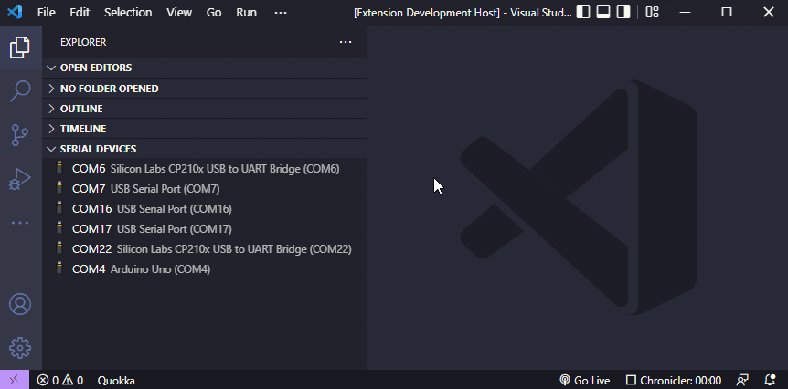
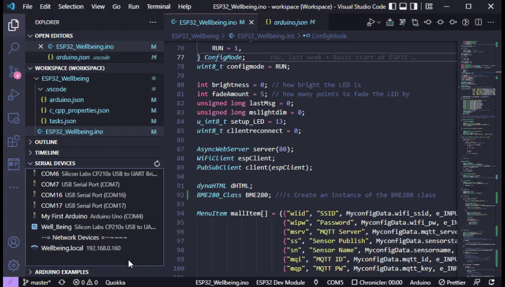

# Serial Devices

This is useful for microcontroller development. It lists the Serial Device and allows for giving them an alternate name. So instead of seeing COM3, you can rename it to ESP32_SENSOR. Since Com port numbers change, it uses the DeviceID/pnpid to be more accurate for the search when checking for name.
NEW ADDITION! I added a mDNS discovery to pull in Arduino OTA devices.
When the Extension is running, it starts the discovery. Since OTA seem to be erratic, I dont clear the list while its dicovering and I stop the broswer and restart it every 60 seconds. The reason for this is due to found devices may not be found again during that 60 seconds of being removed.  
After 6 mimutes of scanning, it clears the list and starts again. This removes stale OTA devices. Pressing the -=Network Devices=- item, forces a clear and refresh immediately.
I just added the ability for it to detect the COM port listed in the arduino.json file. It now highlights the one currently being used.

## Features

Pressing the scan button starts a serial device scan. It will continue to run for about 15 seconds or until a device has been plugged-in or removed.  
You can click on a Device and give it a new name.
This currently does not use USB device detection. Maybe a future version will.

I have an ESP32 Debugger that shows up as two ports.
If you notice below the serial numbers is the same for both COM16 and COM17. If I used the serial number as the search criteria, both ports would be named the same.

`{path: 'COM16', manufacturer: 'FTDI', serialNumber: '7&5261f68&0&4', pnpId: 'FTDIBUS\\VID_0403+PID_6010+7&5261F68&0&4&1\\0000', locationId: undefined, …}`

`{path: 'COM17', manufacturer: 'FTDI', serialNumber: '7&5261f68&0&4', pnpId: 'FTDIBUS\\VID_0403+PID_6010+7&5261F68&0&4&2\\0000', locationId: undefined, …}`

When a Device is removed, it doesn't disappear from the list right away but shows "removed" as the description. It will be removed upon next scan, unless you plugged it back in.

- Allows giving a COM/OTA device a name that is saved to the local storage.
- Over the Air devices with type of 'arduino' are scanned for. This scan is on always.
- Clicking the Arduino Icon next to device will open the Arduino Serial List selector and paste in the Value of the COM port for Serial Devices and the HOSTNAME : IP ADDRESS for a network device.
- The network device being pasted into the Serial port list is probably not very handy but the data is in the clipboard and can be used where needed.
- Can remove a renamed port by clicking the X.
- Hovering over COM device shows the Actual com details.
- Hovering over the OTA shows the OTA details. Full Domain Name, Board Type, etc.
- Checks the arduino.json file for the current COM port being used, shows an icon next to the active port.

## Example of the Serial Device scanning



## Example of the additional arduino.json com port read and Over the Air device discovery.



## Commands

- `Serial Devies: Scan for changes` Same as pressing the refresh button on the page. Scans for device change or until time-out.
- `Serial Devies: Refresh Devices` Does a 1 time scan of Serial Devices.
- `Serial Devies: Refresh MDNS` Forces a refresh of the mDNS discovery. This is always running, but will clear the list if needed and restart it.

## Info / TODO

- I switched my code serial port scanning code to use this one. https://serialport.io/docs/

- A future version will possibly use https://github.com/MadLittleMods/node-usb-detection

- Maybe allow for certain serial device to be hidden from list.

- Would be nice if Arduino extension gave the USB port it is connected to and would allow to be set by another extension.

- Maybe use the arduino.json file for use in the COM details and auto re-label the port based on the projects name.

## Shoutout

- I used this project to create my animated gifs. https://marketplace.visualstudio.com/items?itemName=arcsine.chronicler
  - Chronicler will create animated gifs perfectly, but I wants to add some text in the video.
- I also VSDC Free Video Editor. I used to use HITFILM Express but now it says "hitfilm support for AVC / h264 video requires a licensed version of hitfilm pro". I can't see buying a pro version just to add text to a video when it used to be free. https://www.videosoftdev.com/how-to-add-text-to-your-video-or-an-image

- Here are the commands I used to generate the animated GIF after I edited the video.

```
"C:\Program Files\ffmpeg\bin\ffmpeg.exe" -i SerialD.mp4 -filter_complex "[0:v] palettegen" paletted.png

"C:\Program Files\ffmpeg\bin\ffmpeg.exe" -i SerialD.mp4 -i paletted.png -lavfi "fps=12,paletteuse=dither=bayer:bayer_scale=5:diff_mode=rectangle" -y doutput.gif
```

- First video is Chonicler generating the animated gif, Second video above is Chronicler creating the MP4 file(That HITFILM wont allow editing), I edited in VSDC, exported as mp4, then ran the above commands on it.

## HELP

If you have the arduino extension installed, the code will execute the command below when clicking the arduino icon.
The problem is, it just shows the QuickPick window, but wont send it the correct port. Does anyone know how to send that extension the Port update?

**This would be cool if worked, but this command doesn't expect any paramters.**
`commands.executeCommand("arduino.selectSerialPort", "0x0403", "0x6001")`

The above command actually runs this command:

`public async selectSerialPort(vid: string, pid: string)`

Sadly it does not work, just opens the quick pick but doesnt use the details to select the port.

UPDATE! I'm now able to paste in the selected port but pressing enter is still required to pick it.

### I came from a background where Javascript is used for form validation, not a full blown app. This still seems odd to be using JavaScript when something compiled would be better. With that being said, I would LOVE to see the correct way to code this thing.

## Extension Settings

There are no seetings as of yet.
Might add a configuration option for the type of mDNS device.

## Release Notes

Initial version soon to be released after more cleanup of the code. This was my first Visual Studio Code extension and it changed so many times.

### 1.0.0

Initial release
